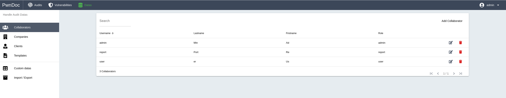

# Data

> Pwndoc uses different kinds of data to improve and mutualize user experience. This allows to have reusable and customizable information across audits.




## Collaborators

Collaborators are users of the application and can be part of an audit either as the creator or as a collaborative user.

A Collaborator is defined by:

- Username
- Lastname
- Firstname
- Role
- Password

There are 3 different roles:

**user**

- Read/Write on created and collaboration Audits
- Readonly on Vulnerabilities
- Read/Write on *Companies* and *Clients* Data

**report**

- Inherit from user role
- \+ Read/Write on all Audits

**admin**

- Read/Write on everything


## Companies

Companies that order an Audit.

A Company is defined by:

- Name
- Logo


## Clients

Specific clients of companies. Generally the point of contact during a mandate.

A Client is defined by:

- Company
- Lastname
- Firstname
- Email
- Function
- Phone
- Cell

## Templates

Templates are Word documents with special tags that are filled with Audit data when generating the report. See [Docx Template](/docxtemplate.md) section.

A Template is defined by:

- Name
- File

## Custom Data

Custom Data represent a way to fully customize Audits and Vulnerabilities. They are editable and their order can be changed to personalize how they will be displayed for users.

!> Values must match this regex:  `/^[A-zÀ-ú0-9 \[\]\'()_-]+$/`

### Languages

Pwndoc can handle multiple Languages when it comes to Custom Data or Vulnerabilities. It's one of the first things to create before being able to start an Audit.

A Language is defined by:

- Language: the displayed name in the application
- Locale: the value used to identify a language in API calls

> Example
> ```
Language: English   Locale: en
Language: French    Locale: fr
> ```

### Audit Types

Audit Types represent the nature of an Audit. They can be configured to define default parameters for an Audit.

An Audit Type is defined by:

- Name
- Templates: For each Language a default template can be configured
- Sections: Any Custom Section here will be added when creating an Audit with this Audit Type
- Hidden Sections: Hide built-in sections if not necessary (Network or Findings)

> Example
>```
Name: Web Application,
Templates: [English Template, French Template],
Sections: [Executive Summary, Nessus Scan],
Hidden Sections: [Network]
> ```

### Vulnerability Types

Vulnerability Types represent the nature of a Vulnerability. They are multilinguale.

A Vulnerability Type is defined by:

- Name

> Example
>```
English
    Name: Wireless,
    Name: Mobile Application
French
    Name: Réseau Sans Fil
    Name: Application Mobile
> ```

### Vulnerability Categories

Vulnerability Categories are used to categorize a Vulnerability.

A Vulnerability Category is defined by:

- Name

> Example
>```
Name: Nessus Scan
> ```

### Custom Fields

Custom Fields allow to have additionnal Fields in an Audit or a Vulnerability. They are multilingual.

A Custom Field is defined by:

- View: The page on which Custom Fields will be added
    - Audit General
    - Audit Finding: A Vulnerability Category can be selected. If no Category is selected then every Findings will have Custom Fields
    - Audit Section: A specific Section can be selected. If no Section is selected then every Sections will have Custom Fields
    - Vulnerability: A Vulnerability Category can be selected. If no Category is selected then every Vulnerabilities will have Custom Fields
- Component: The Custom Field type to use
    - Checkbox
    - Date
    - Editor
    - Input
    - Radio
    - Select
    - Select Multiple
    - Space (an empty component used for inserting spaces between other components)
- Label: The displayed value in the GUI and lowercase + strip spaces to use in the docx template
- Description: A hint to be displayed under the component
- Size: The width of the field (1 to 12)
- Offset: The offset from which to start displaying the field (1 to 12)
- Required: The field is required and must not be empty
- Options: Used for multiple selection fields (multiple languages supported)

Each field can have a default value for each existing language.

> Example
> ```
View: Audit Section
Selected Section: Executive Summary
Component: Editor
Label: Text
Size: 12
Required: True
>  
-> This will display an additional HTML editor «Text» field in Executive Summary Sections
>  
View: Vulnerability
Selected Category: None
Component: Input
Label: Id
Size: 2
>  
-> This will display an additional input «Id» field in vulnerabilities that will also be displayed in findings
>```

### Custom Sections

Custom Sections allow to have additionnal Sections in an Audit.

A Section is defined by:

- Name
- Name
- Field: Used in docx template
- Icon: material, mdi and font awesome are supported

> Example
> ```
Name: Cleanup
Field: cleanup
Icon: mdi-broom
>```
