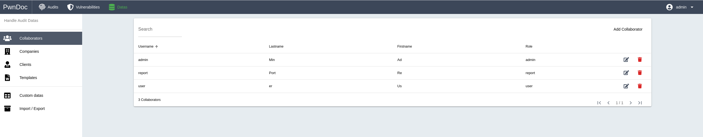

# Data

> Pwndoc uses different kinds of data to improve and mutualize user experience. This allows to have reusable and customizable information across audits.




## Collaborators

Collaborators are users of the application and can be part of an audit either as the creator or as a collaborative user.

A Collaborator is defined by:

- Username
- Lastname
- Firstname
- Role
- Password

There are 3 different roles:

**user**

- Read/Write on created and collaboration Audits
- Readonly on Vulnerabilities
- Read/Write on *Companies* and *Clients* Data

**report**

- Inherit from user role
- \+ Read/Write on all Audits

**admin**

- Read/Write on everything


## Companies

Companies that order an Audit.

A Company is defined by:

- Name
- Logo


## Clients

Specific clients of companies. Generally the point of contact during a mandate.

A Client is defined by:

- Company
- Lastname
- Firstname
- Email
- Function
- Phone
- Cell

## Templates

Templates are Word documents with special tags that are filled with Audit data when generating the report. See [Docx Template](/docxtemplate.md) section.

A Template is defined by:

- Name
- File

## Custom Data

Custom Data represent a way to fully customize Audits and Vulnerabilities. They are editable and their order can be changed to personalize how they will be displayed for users.

!> Values must match this regex:  `/^[\p{Letter}\p{Mark}0-9 \[\]'()_-]+$/iu`

### Languages

Pwndoc can handle multiple Languages when it comes to Custom Data or Vulnerabilities. It's one of the first things to create before being able to start an Audit.

A Language is defined by:

- Language: the displayed name in the application
- Locale: the value used to identify a language in API calls

> Example
> ```
Language: English   Locale: en
Language: French    Locale: fr
> ```

### Audit Types

Audit Types represent the nature of an Audit. They can be configured to define default parameters for an Audit.

An Audit Type is defined by:

- Name
- Stage: Select the type of audit created with this Audit Type (`default`, `retest`, or `multi`)
- Templates: For each Language a default template can be configured
- Sections: Any Custom Section here will be added when creating an Audit with this Audit Type
- Hidden Sections: Hide built-in sections if not necessary (Network or Findings)

> Example
>```
Name: Web Application,
Stage: default,
Templates: [English Template, French Template],
Sections: [Executive Summary, Nessus Scan],
Hidden Sections: [Network]
> ```

### Vulnerability Types

Vulnerability Types represent the nature of a Vulnerability. They are multilinguale.

A Vulnerability Type is defined by:

- Name

> Example
>```
English
    Name: Wireless,
    Name: Mobile Application
French
    Name: Réseau Sans Fil
    Name: Application Mobile
> ```

### Vulnerability Categories

Vulnerability Categories are used to categorize a Vulnerability.

A Vulnerability Category is defined by:

- Name

> Example
>```
Name: Nessus Scan
> ```

### Custom Fields

Custom Fields allow to have additionnal Fields in an Audit or a Vulnerability. They are multilingual.

A Custom Field is defined by:

- View: The page on which Custom Fields will be added
    - Audit General
    - Audit Finding: A Vulnerability Category can be selected. If no Category is selected then every Findings will have Custom Fields
    - Audit Section: A specific Section can be selected. If no Section is selected then every Sections will have Custom Fields
    - Vulnerability: A Vulnerability Category can be selected. If no Category is selected then every Vulnerabilities will have Custom Fields
- Component: The Custom Field type to use
    - Checkbox
    - Date
    - Editor
    - Input
    - Radio
    - Select
    - Select Multiple
    - Space (an empty component used for inserting spaces between other components)
- Inline: Available for `Checkbox` and `Radio` components to render options horizontally instead of vertically
- Label: The displayed value in the GUI and lowercase + strip spaces to use in the docx template
- Description: A hint to be displayed under the component
- Size: The width of the field (1 to 12)
- Offset: The offset from which to start displaying the field (1 to 12)
- Required: The field is required and must not be empty
- Options: Used for multiple selection fields (multiple languages supported)

Each field can have a default value for each existing language.

> Example
> ```
View: Audit Section
Selected Section: Executive Summary
Component: Editor
Label: Text
Size: 12
Required: True
>  
-> This will display an additional HTML editor «Text» field in Executive Summary Sections
>  
View: Vulnerability
Selected Category: None
Component: Input
Label: Id
Size: 2
>  
-> This will display an additional input «Id» field in vulnerabilities that will also be displayed in findings
>```

### Custom Sections

Custom Sections allow to have additionnal Sections in an Audit.

A Section is defined by:

- Name
- Field: Used in docx template
- Icon: material, mdi and font awesome are supported

> Example
> ```
Name: Cleanup
Field: cleanup
Icon: mdi-broom
>```

## Spellcheck Dictionary

The Spellcheck Dictionary is a per-deployment list of words that LanguageTool will ignore when checking grammar and spelling. This is useful for technical terms, product names, and jargon that LanguageTool would otherwise flag.

> Spellcheck must be enabled and configured in [Settings](settings.md#spellcheck).


Words are shared across all users. The table is searchable and paginated.

**Add a word:** Click **Create Word**, type the word, and confirm. The word is saved to the database and excluded from future spellcheck results immediately.

**Remove a word:** Click the delete icon on any row and confirm.

Requires `settings:update` permission to add or remove words.

## LanguageTool Rules

Custom LanguageTool Rules let you define project-specific grammar rules in LanguageTool XML format. Rules are loaded into the LanguageTool service and applied alongside the built-in rules.

> This feature requires a self-hosted LanguageTool instance that supports custom rules. If your instance doesn't support them, a warning banner is shown and rule creation is disabled.


### Create a Rule

Click **Create Rule** and fill in the form:

| Field | Description |
|-------|-------------|
| Language | The language this rule applies to (loaded from your LanguageTool instance) |
| Rule XML | The rule definition in LanguageTool XML format |

The rule ID and name are extracted automatically from the XML. A template is shown in the text area as a starting point.

After creation, all rules are reloaded into LanguageTool automatically.

### View a Rule

Click the view icon on any row to open the rule XML in a read-only dialog.

### Delete a Rule

Click the delete icon on any row and confirm. Rules are reloaded into LanguageTool after deletion.

Requires `settings:update` permission to create or delete rules.

## Dump

The Dump page provides bulk import and export of vulnerability data.


### Export Vulnerabilities

Click **Export** to download the entire vulnerability database as a YAML file. The format is the same as the import format and can be used for backup or migration between PwnDoc instances.

### Import Vulnerabilities

Click the file input to select one or more `.yml` or `.json` files, then click **Import**. Imported vulnerabilities are merged into the existing database.

Requires `vulnerabilities:create` permission.

### Delete All Vulnerabilities

Click **Delete All** to permanently remove every vulnerability from the database. A confirmation prompt is shown before the operation.

> This action is irreversible. Export your vulnerabilities first if you need a backup.

Requires `vulnerabilities:delete-all` permission (admin only).

> Audit dump (bulk export/import of audits) is not yet implemented.
